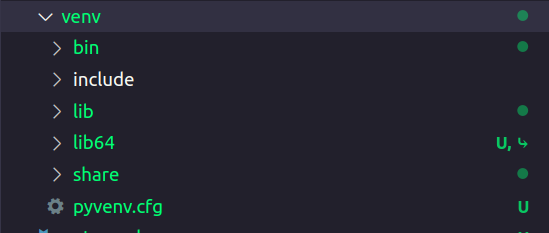

# Notes

~~~bash
    python3 -m venv venv
~~~

**The flag `-m` indicates that we will execute a Python library as a script.**
 

**`venv` is a Python library used to create virtual environments.**
 

**The second occurrence of venv is the name of the virtual environment we are creating.**

This command generates this structure: 

 

This command activates our virtual environment:

~~~bash
    source venv/bin/activate
~~~

 

This command kills our virtual environment:

~~~bash
    deactivate
~~~